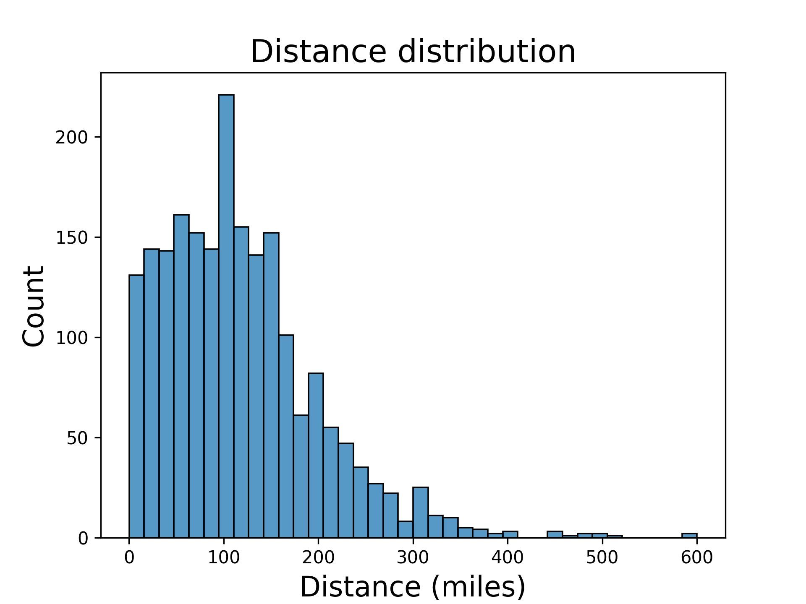

# Introduction

A script to parse an HTML table of running results and do a quick analysis.  This was initially inspired by wanting to sort results by elevation gain from the 'Summer GRIT' running challenge.

# Setup

```shell
# set up virtual env with pyenv
pyenv virtualenv 3.11.7 parse-running-results
pyenv shell parse-running-results

# clone the repo
git clone git@github.com:mrperkett/grit-running-data.git
cd grit-running-data

# install requirements
python3 -m pip install requirements.txt
```

Run unit tests to verify the setup 

```shell
$ python3 -m pytest

=================================================== test session starts ====================================================
platform linux -- Python 3.11.7, pytest-8.3.2, pluggy-1.5.0
rootdir: /home/mperkett/projects/grit-running-data
configfile: pyproject.toml
plugins: mock-3.14.0
collected 15 items

tests/test_parsing.py ...............                                                                                [100%]

==================================================== 15 passed in 0.40s ====================================================
```

# Usage

You can convert the running results HTML table into a CSV using the `parse_results.py` script.  You can generate statistics using this CSV file as input to the `explore_grit_results.ipynb` Jupyter notebook.  The only manual step is saving the HTML results file, which is straightforward with instructions provided below.  It may be possible to automate scraping the results HTML, but the website configuration for the competition results seemed to discourage this.  So I did not pursue it.

I have also included a script `obfuscate_results.py` to replace the first and last names of participants in an HTML file so that you can anonymize the HTML file.  This script was used to generate the example HTML file in this repo.

## Saving HTML file

1. Navigate to the race results on runsignup.com and select to view "All" results.

2. Use the Developer tools to select the table.  In Chrome, use `Ctrl + Shift + C` to do this and click just above the table.

    

3. Right click the table element and save it to file

    

## Converting to CSV

```
usage: parse_results.py [-h] --input INPUT_FILE_PATH --output OUTPUT_FILE_PATH

options:
  -h, --help            show this help message and exit
  --input INPUT_FILE_PATH, -i INPUT_FILE_PATH
                        HTML input file path
  --output OUTPUT_FILE_PATH, -o OUTPUT_FILE_PATH
                        CSV output file path
```

Example:

```shell
python3 ./parse_results.py -i input/example-results.html -o output/example-results.csv
```

## Generating stats

To generate statistics, run the `explore_grit_results.ipynb` Jupyter notebook.

## Anonymizing HTML

```
usage: obfuscate_results.py [-h] --input INPUT_FILE_PATH --output OUTPUT_FILE_PATH

options:
  -h, --help            show this help message and exit
  --input INPUT_FILE_PATH, -i INPUT_FILE_PATH
                        HTML input file path
  --output OUTPUT_FILE_PATH, -o OUTPUT_FILE_PATH
                        obfuscated HTML output file path
```

Example:

```shell
python3 ./obfuscate_results.py -i input/grit-table-2024.08.01-full.html -o input/example-results.html
```


# Summary

Here are some of the results after the close of the month-long running competition.  All data has been anonymized and is provided in [input/example-results.html](input/example-results.html) and [output/example-results.csv](input/example-results.csv).

See more of the results in [explore_grit_results.ipynb](explore_grit_results.ipynb).

## Distances




## Elevation gain


